# Comandos para la monitorización de almacenamiento:
### Comando free
Es una herramienta cuya utilidad principal es analizar el tráfico que circula por la red. 
Permite al usuario capturar y mostrar en tiempo real los paquetes transmitidos y recibidos por la red a la cual el ordenador está conectado.
- free -b  Muestra la memoria en bytes
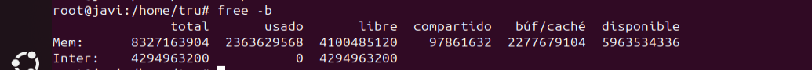
- free -m  Muestra la memoria en megabytes (MB).
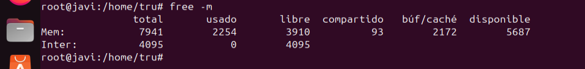
- free -g  Muestra la memoria en gigabytes (GB).
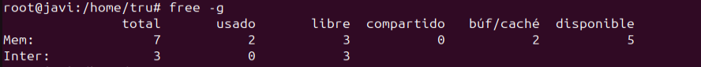

### Comando df
El comando df (disk free) se utiliza para obtener un informe del espacio total, usado y disponible en los sistemas de archivos montados.
- df -T Muestra el tipo de sistema de archivos de cada partición (por ejemplo, ext4, xfs, nfs, etc.).
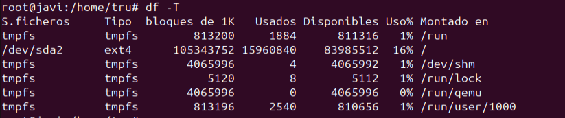
- df -a Muestra todos los sistemas de archivos, incluidos los sistemas de archivos con 0 bloques de uso, como los montajes virtuales (por ejemplo, proc, sysfs, tmpfs, etc.).
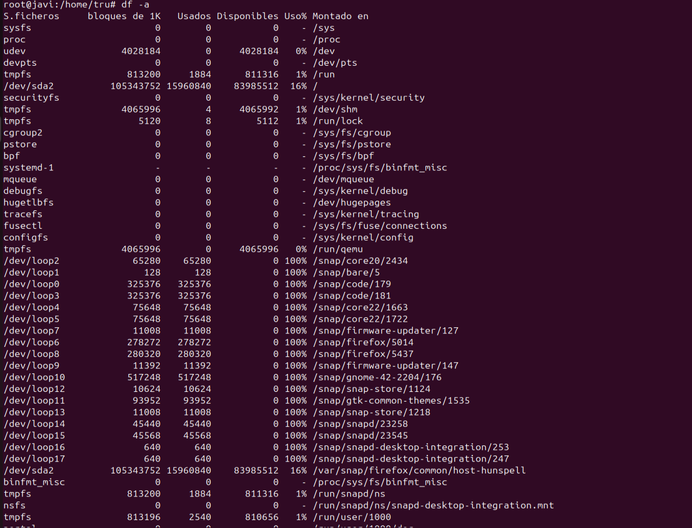
- df -l Muestra solo los sistemas de archivos locales (excluyendo los montajes de red como NFS, CIFS, etc.).
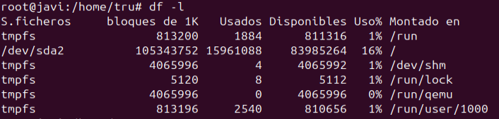

### Comando du
Es un comando que significa “Disk Usage” (uso de disco). Su función principal es mostrar el espacio en disco utilizado por archivos y directorios en el sistema.
- du -x Muestra solo los archivos y directorios en el mismo sistema de archivos. Esto puede ser útil si tienes montajes de red o particiones adicionales.
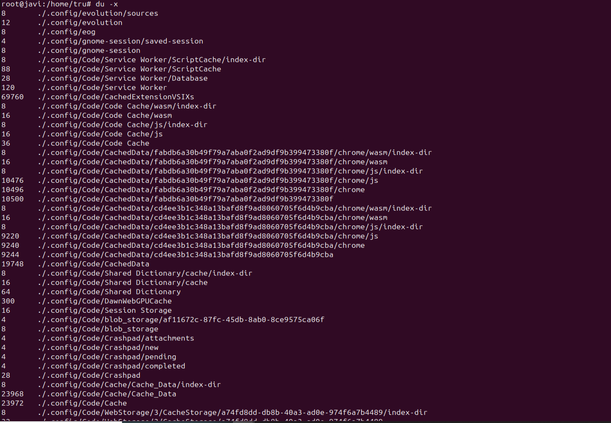
- du -l Cuenta los archivos múltiples (con enlaces duros) solo una vez, en lugar de contar cada enlace por separado.
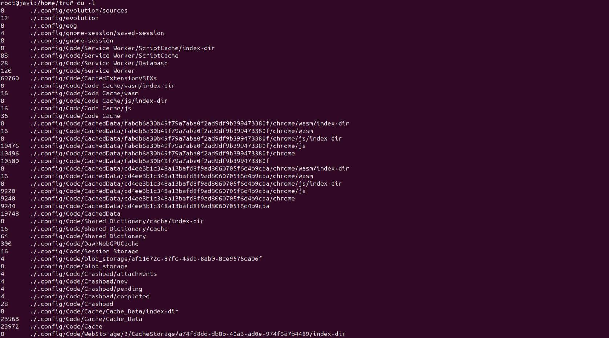
- du -P Muestra el tamaño del enlace simbólico en sí.
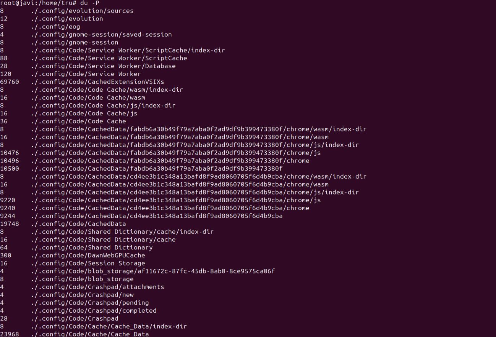

### Comando iostat
Es fundamental para el análisis y la optimización del rendimiento del disco en servidores.
- iostat -c Muestra las estadísticas de la CPU, como el porcentaje de uso de la CPU para el sistema, la aplicación de usuario y el tiempo de inactividad.
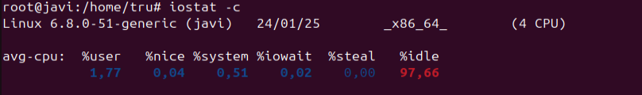
- iostat -z Omite los dispositivos que no han tenido actividad de entrada/salida.
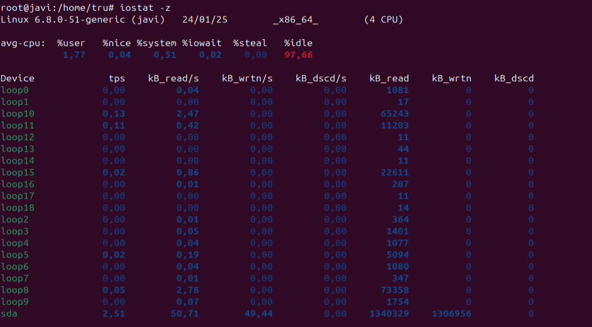
- iostat -t Muestra la hora en que se toma cada muestra de las estadísticas.
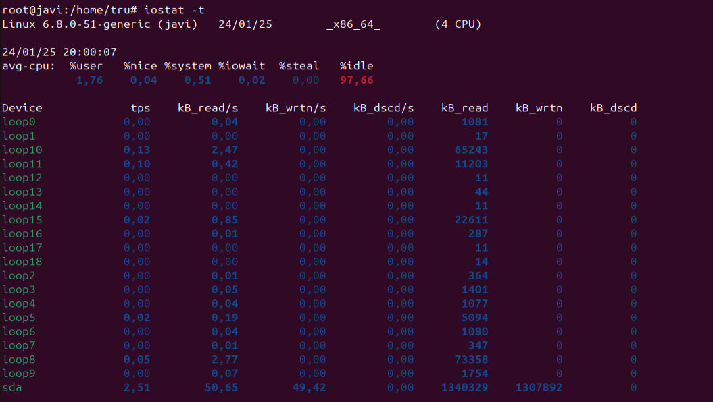
