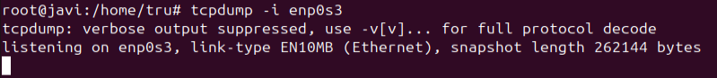
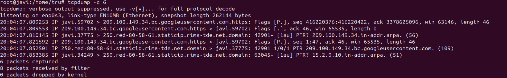
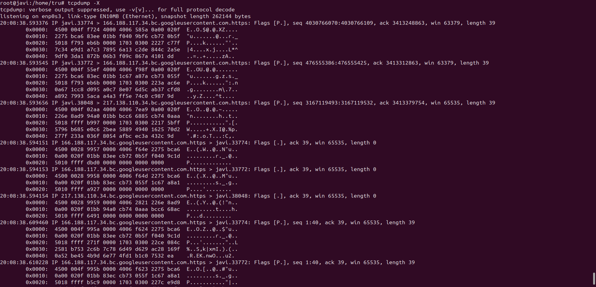
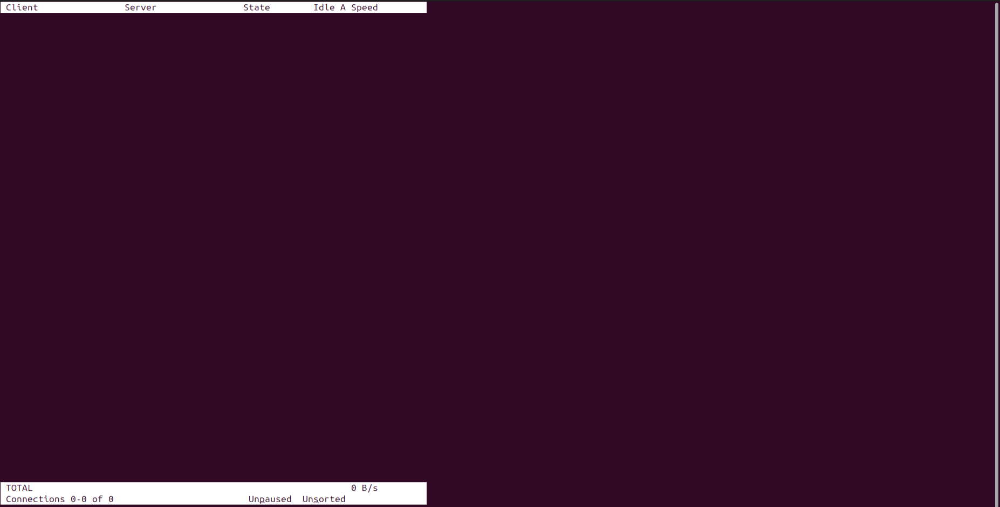
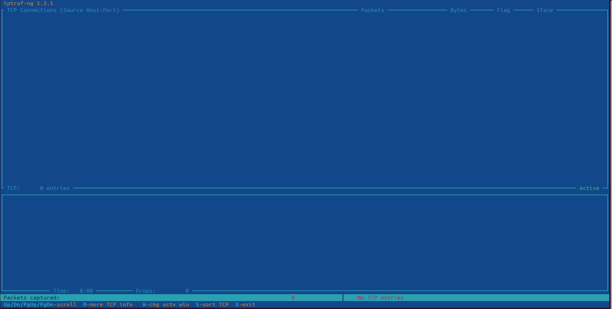
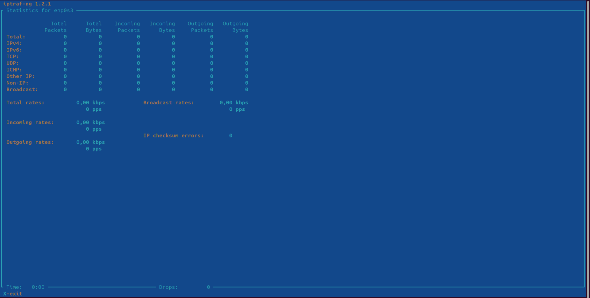
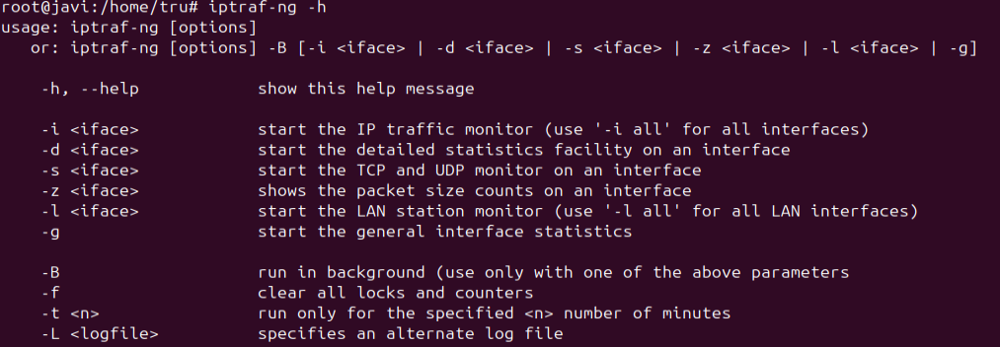
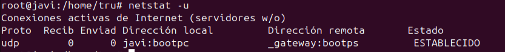
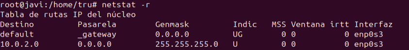
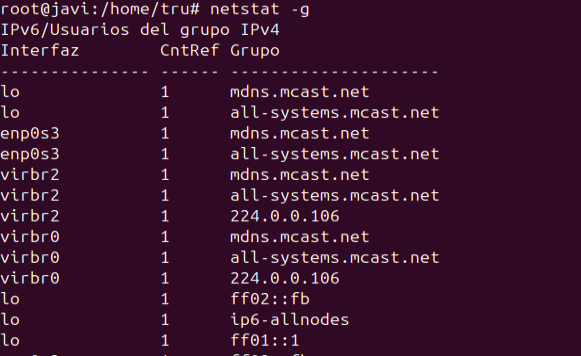

# Comandos para la monitorización de red:
### Comando tcpdump
tcpdump es una herramienta de software que permite capturar y analizar los paquetes de datos que viajan por una red en tiempo real. Se utiliza para observar el tráfico de red, diagnosticar problemas y entender cómo se comunican las aplicaciones y dispositivos en la red. Funciona mostrando información detallada sobre los paquetes, como la dirección de origen, destino, el protocolo utilizado, y otros datos clave.
El comando free sin opciones nos devolverá entonces los resultados para la memoria Total, Usada y Libre de tu ordenador o servidor.
- tcpdump -i + la interfaz de red, Especifica la interfaz de red en la que quieres escuchar el tráfico.

- tcpdump -c + el numero de paquetes, Limita la captura a un número específico de paquetes.

- tcpdump -X Muestra el contenido de los paquetes en formato hexadecimal y ASCII. Es útil para ver los datos de los paquetes, como los contenidos de una solicitud HTTP, por ejemplo.

### Comando tcptrack
tcptrack es una herramienta que te permite ver las conexiones de red activas que utilizan el protocolo TCP en tu sistema, de una manera visual y fácil de seguir. En vez de mostrar todos los paquetes de datos como lo hace tcpdump, tcptrack solo muestra las conexiones TCP abiertas, actualizando la información constantemente.
Es como un "monitor" para las conexiones de red, donde puedes ver direcciones IP están conectadas, puertos que están siendo utilizados y el estado de esas conexiones.
- tcptrack -i + la interfaz de red, Especifica la interfaz de red que deseas monitorear que en nuestro caso es la enp0s3

- tcptrack -n Muestra las direcciones IP y puertos en formato numérico, sin intentar resolver los nombres de host o los nombres de servicio. Esto puede hacer que la salida sea más rápida.
- tcptrack -v Muestra más detalles sobre las conexiones, como el estado de la conexión.

### Comando iptraf-ng
Iptraf-ng es una herramienta que te permite ver y analizar el tráfico de red en tu sistema Linux en tiempo real. Es una versión mejorada de una herramienta más antigua llamada iptraf, con una interfaz más fácil de usar.
Con esta herramienta se puede analizar todo lo que está pasando en la red de cada ordenador, las conexiones activas, los protocolos que se están usando (como TCP o UDP), y las estadísticas sobre la cantidad de datos que se están transmitiendo.
Lo que hace que iptraf-ng sea útil es que ofrece toda esta información de forma clara, actualizada constantemente, y en una interfaz basada en texto (en la terminal), sin necesidad de herramientas más complicadas como Wireshark.
- iptraf-ng -i + la interfaz de red, Especifica la interfaz de red que deseas monitorear.

- iptraf-ng -d Muestra estadísticas detalladas sobre la actividad de cada interfaz de red y el tráfico.

- iptraf-ng -h Muestra la ayuda, listando todas las opciones disponibles del comando.

### Comando netstat
Netstat (abreviatura de "network statistics") es una herramienta de línea de comandos que se usa para mostrar información sobre las conexiones de red en tu sistema. Te permite ver qué puertos están abiertos, qué conexiones están activas, qué protocolos están siendo utilizados y otra información relacionada con la red.
Con Netstat se pueden analizar las conexiones que están activas, los puertos de escucha y las estadisticas de red.
- netstat -u Muestra solo las conexiones UDP activas.

- netstat -r Muestra la tabla de enrutamiento del sistema, puedes ver cómo se enrutan los paquetes en la red.

- netstat -g Muestra las direcciones de grupo multicast activas.

