# Comandos para la monitorización de procesos:
### Comando ps
El comando ps (process status) nos informa sobre el estado de los procesos. Dependiendo de los parámetros que le demos nos mostrara un tipo de información u otra y unos procesos u otros.
- ps -A: muestra todos los procesos que se están ejecutando en el sistema (los de todos los usuarios).

- ps -f: muestra todos los procesos con mayor detalle.
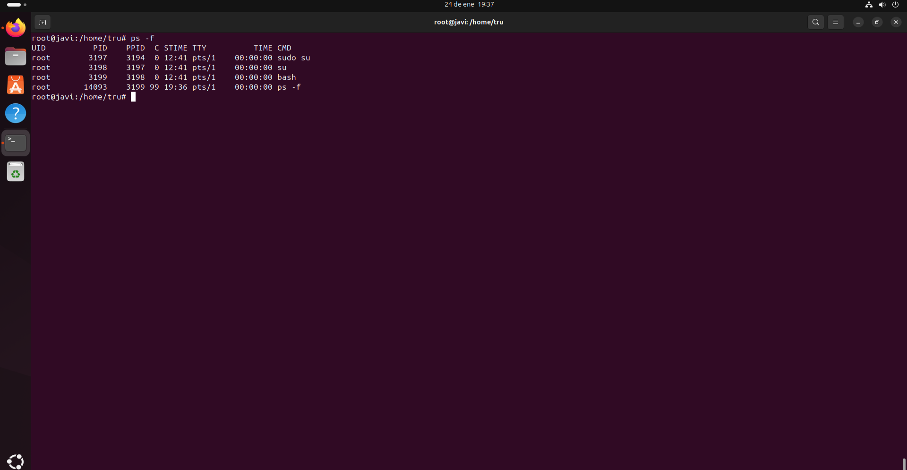  
- ps -x: muestra únicamente los procesos que pertenecen al usuario ejecutor.
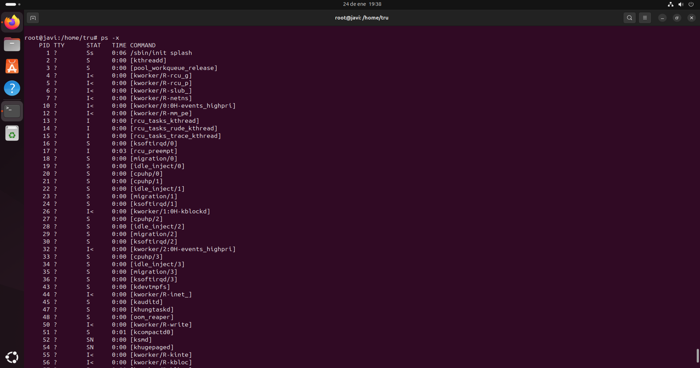  

### Comando top
El comando top se utiliza para descubrir procesos que consumen muchos recursos. Este comando de Linux ordenará la lista por uso de CPU, de modo que el proceso que consuma más recursos se colocará en la parte superior. También es útil para comprobar si un proceso específico se está ejecutando.
- top -h Muestra la ayuda del comando top.
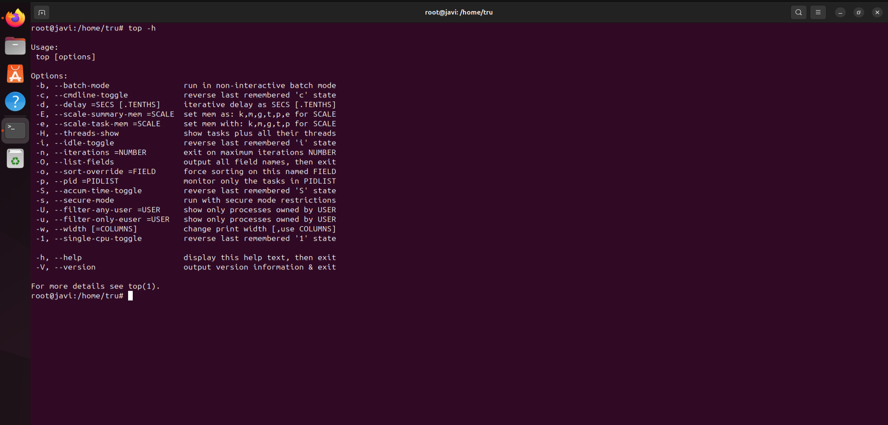
- top -s Cambia la frecuencia de actualización de la pantalla.
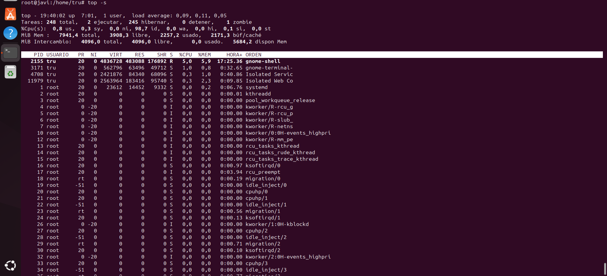
- top -c Muestra el comando completo de los procesos, en vez del nombre.
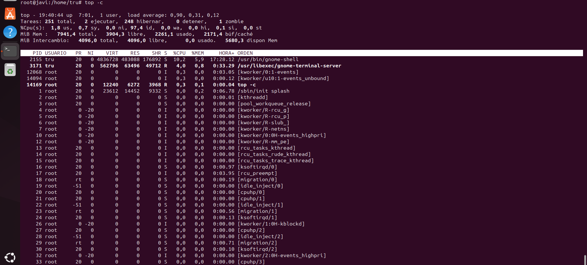

### Comando htop
Es un visor de procesos y una aplicación en modo de texto para la supervisión del sistema en tiempo real, similar a top. Es fácil de usar y muestra una lista completa de los procesos que se ejecutan.
- htop F2 Abre el menú de configuración, donde puedes personalizar la interfaz.
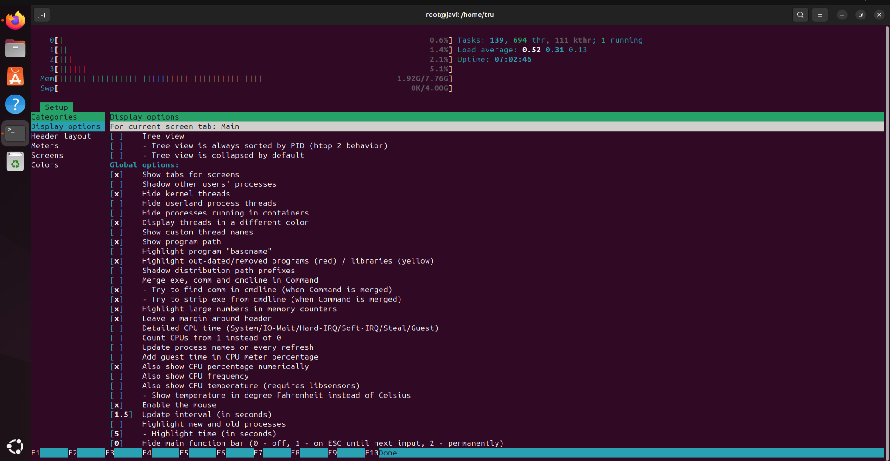
- htop F3 Permite buscar un proceso por nombre o por PID.
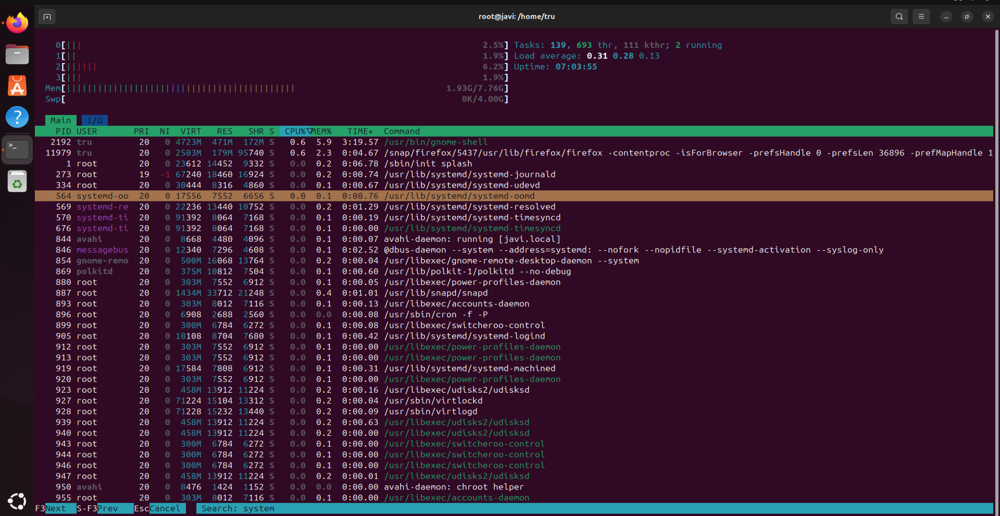
- htop F4 Filtra los procesos por el nombre.
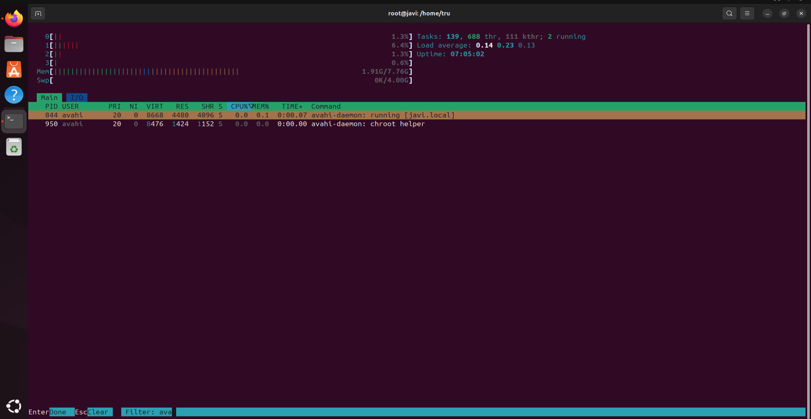

### Comando atop
Es un programa de monitorización ASCII con el que se puede visualizar la carga del sistema en Linux. Al iniciar atop, se muestra el uso de la CPU y la memoria, así como información sobre los archivos de intercambio, discos duros/SSD y conexión de red en intervalos de 10 segundos.
- atop -d Muestra estadísticas de los discos.
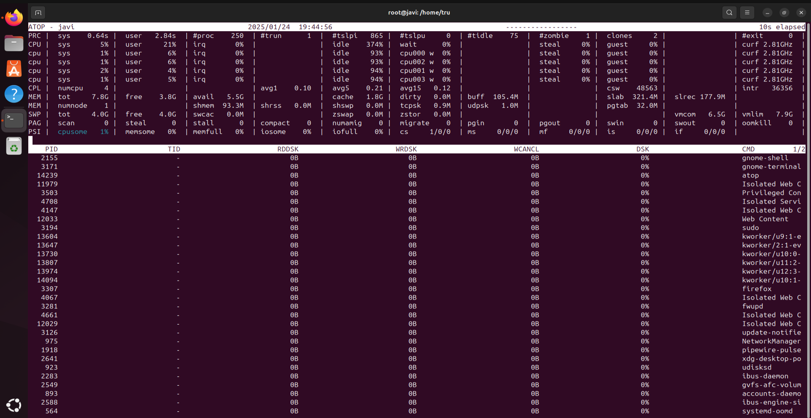
- atop -c Muestra las estadísticas de los procesos.
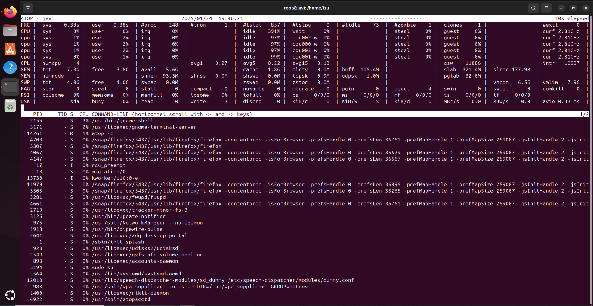
- atop -R Muestra estadísticas de red detalladas.
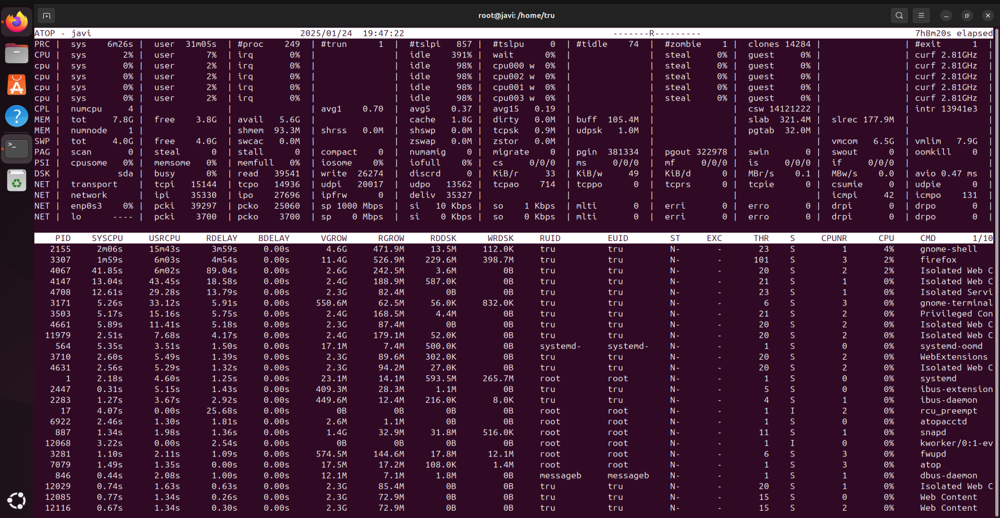

