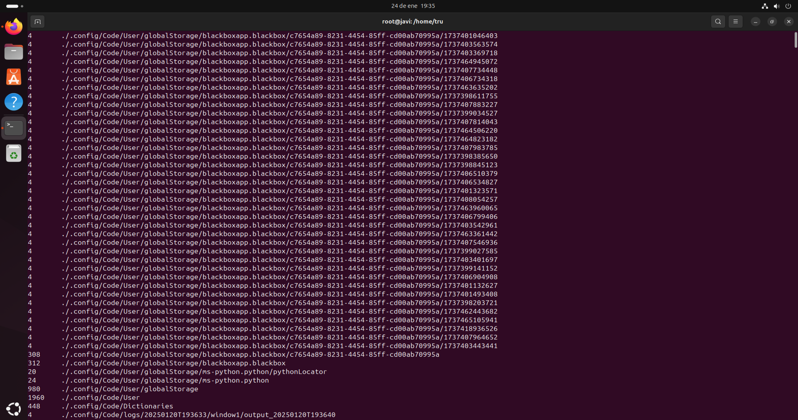

# Comandos para la monitorización de procesos:
### Comando ps
El comando ps se usa para ver qué programas o procesos están ejecutandose en cada equipo en ese momento. Cada vez que se ejecuta una aplicación o incluso cuando se hace uso de la terminal, se crea un "proceso" en el sistema. Con ps, puedes ver una lista de todos esos procesos que están en ejecución, quién los está ejecutando, cuánto tiempo llevan corriendo, cuánto espacio de memoria usan, etc.
Es como un vistazo rápido a lo que está pasando dentro del sistema, para saber qué está activo y cómo está funcionando todo.
- ps -A: muestra todos los procesos que se están ejecutando en el sistema (los de todos los usuarios).

- ps -f: muestra todos los procesos con mayor detalle.
  
- ps -x: muestra únicamente los procesos que pertenecen al usuario ejecutor.
  

### Comando top
El comando top es como un "monitor" en tiempo real para el equipo en cuestión. Muestra todo lo que está pasando en el sistema, qué programas están corriendo, cuánta memoria están usando y cuánto de la CPU está siendo consumido. Lo bueno de top es que muestra esta información de forma continua, por lo que siempre se sane lo que está pasando en ese momento. A diferencia de ps, que solo ofrece un resumen estático, top se actualiza constantemente para que se pueda observar el rendimiento del ordenador al instante. Es ideal para saber si algún proceso está usando demasiados recursos o si la máquina está funcionando lenta por alguna razón.
- top -h Muestra la ayuda del comando top.

- top -s Cambia la frecuencia de actualización de la pantalla.

- top -c Muestra el comando completo de los procesos, en vez del nombre.

### Comando htop
Htop es como una versión más moderna y fácil de usar de top. Muestra en tiempo real qué procesos están ejecutandose en el ordenador y cómo está usando los recursos, pero con una interfaz mucho más visual y ordenada. En lugar de solo ver números y listas, htop usa barras de colores para mostrar el uso de la CPU, la memoria y otros recursos, lo que hace todo más claro.
Lo mas destacable de htop es que puede interactuar directamente con los procesos. Si se observa que uno de estos está usando demasiada CPU o memoria, puede seleccionarse ese proceso y matarlo sin tener que escribir comandos complicados. También se puede buscar procesos rápidamente o cambiar la prioridad de alguno.
- htop F2 Abre el menú de configuración, donde puedes personalizar la interfaz.

- htop F3 Permite buscar un proceso por nombre o por PID.

- htop F4 Filtra los procesos por el nombre.

### Comando atop
Atop es como top y htop pero con una ventaja, no solo muestra lo que está pasando en el sistema en ese momento, sino que guarda un historial de lo que ha estado pasando.
Es como tener una grabación de lo que hizo el sistema a lo largo del tiempo, lo que ayuda a entender mejor si hubo algún abuso del uso de la CPU, memoria o disco que causó problemas en tu sistema.
- atop -d Muestra estadísticas de los discos.

- atop -c Muestra las estadísticas de los procesos.

- atop -R Muestra estadísticas de red detalladas.

